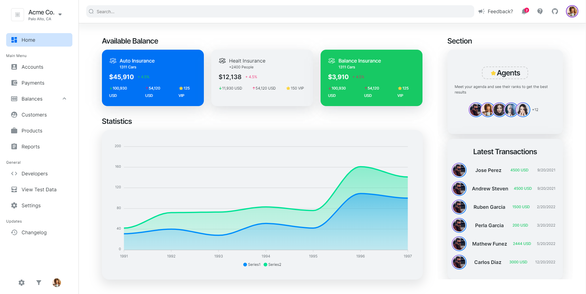

# NextJS EduSpace Admin Dashboard

### Dark Mode


### Light Mode



- Dark Mode Support
- Full Responsive
- Home Page with Charts
- Accounts Page
- More pages coming soon...

```
├── components
│   ├── accounts            # Accounts components
│   ├── charts              # Charts components
│   ├── breadcrumb          # component
|   ├── home                # Home components
|   ├── layout              # Layout components
|   ├── navbar              # Navbar components
|   ├── sidebar             # Sidebar components
|   ├── table               # Table components
|   ├── styles              # Some reusable components
|   ├── icons               # Icons
|   ├── hooks               # Hooks
├── app                     # Documentation files
│   ├── accounts            # Accounts route
|       ├── page.tsx        # Accounts page
│   ├── page.tsx            # Entry point for the app
│   ├── layout.tsx          # Layout applied to all application pages
│   ├── providers.tsx       # Theme provider
│   ├── more...             # Soon
└──
```

## For Run

Install dependencies

```bash
npm install
```

Start the server

```bash
npm run dev
```

Now you can visit https://localhost:3000 in your browser.
